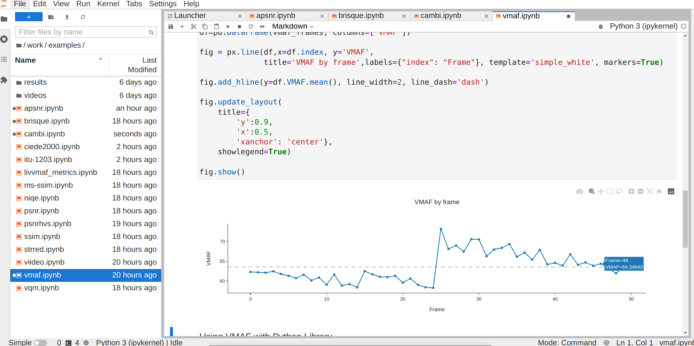

# VIDEO QUALITY METRICS TOOLKIT - VQMTK

This repository describes a container that includes the artifacts to compute 14 video quality metrics and the SI/TI indicators. The container includes Jupyter notebooks to show how to compute each metric. Besides, a command line interface script is included. This script allows the computation of a combination of metrics and can be integrated in any processing pipeline.

## Cite
This work in under revision in SoftwareX (this is a provisional bibtex entry):

```bib
@article{doi,
authors={Wilmer Moina-Rivera and Juan Gutiérrez-Aguado and Miguel Garcia-Pineda},
journal={SoftwareX},
title={Video Quality Metrics Toolkit: An Open Source Software to Assess Video Quality},
vol={Under revision},
year={2023},
doi={},
}
```
If you use this container, please cite that paper.

## Run the container and explore the Jupyter notebooks

In the following we assume that you are using the dockerhub image, if you want to use the local built image change the image to `vqmt:latest` (or the name given to that local image).

### Run the container using the sample videos included in the image

Start the container
```sh
docker run --name vqmtk -d -p 8888:8888 -p 8050:8050 -e JUPYTER_ENABLE_LAB=yes  cloudmedialab/vqmtk:latest
```

Once the container is executed we must check the logs (this works in Linux, in other OS you must just run `docker logs vqmtk` and search for the URL):

```sh
docker logs vqmtk | grep "http://127" | tail -n1 | awk -F"or" '{print $2}'
```
to obtain the URL that can be used to open the Jupyter notebooks included in the image. Open that URL in a browser.

The container image includes some videos, some notebooks that illustrate how to obtain the metrics, and the results already computed. If you want to see the plots you do not need to run the scripts.



To stop the container:
```sh
docker stop vqmtk
```

To start again the container:
```sh
docker start vqmtk
```
If you do not remember the URL to access Jupyter then you can search again in the logs of the container: `docker logs vqmtk`.

You can check if the container is running with the following command:
```sh
docker ps
```

To delete the container (**be carefull**: all the information not stored in a mounted volume will be lost):
```sh
docker rm vqmtk
```
You cannot run two containers with the same name in the same machine. You can assign a different name to the second one or delete the first one.

### Run the container providing your videos
In the following, we assume that there is a folder in your file system named `MY_FOLDER`with a subfolder `experiments` that contains subfolders `videos` and `results`.
The `videos` subfolder contains the videos that you want to analyze. The `results` folder will contain the results of the metrics.

You can store the notebooks in the `experiments` subfolder (this replicates the structure provided in the `examples` folder).

Assuming that you are in the folder `MY_FOLDER`, you can start the container with the following command:

```sh
docker run --name vqmtk -d -p 8888:8888 -p 8050:8050 -e JUPYTER_ENABLE_LAB=yes -v "${PWD}":/home/jovyan/work/experiments cloudmedialab/vqmtk:latest
```
Inside Jupyter, we can see a new folder named `experiments` (inside the folder `work`)  and all the files created inside this folder will be stored in our file system.

### Remote access as a service
For remote access, we recommend to use this container along with Nginx and a valid certificate, and use `docker-compose` to start both containers. This is out of the scope of this project, you can find documentation elsewhere.

## Run the vqmcli script included in the container

List the allowed options of the script:
```sh
docker run --rm --name vqmcli cloudmedialab/vqmtk:latest vqmcli -h
```
In that sample call, the container is deleted after the execution of the script (with the `--rm` option).


This is a working example of usage:
```
# Create directories
mkdir -p /tmp/videos/dist
mkdir -p /tmp/videos/ref

# To avoid write permissions problems inside the container
chmod -R 777 /tmp/videos

# Download a video
wget https://cdn.spacetelescope.org/archives/videos/hd_1080p25_screen/hubblecast06f.mp4 -O /tmp/videos/ref/ref.mp4

# Use ffmpeg (included in the container) to generate a distorted version
docker run --rm --name ffmpeg -v /tmp/videos:/videos vqmtk:latest ffmpeg -y -i /videos/ref/ref.mp4 -c:v libx264 -crf 40 /videos/dist/dist.mp4

# Compute video quality metric VMAF and SITI using the script vqmcli
# included in the container:
docker run --rm --name vqmcli -v /tmp/videos:/videos vqmtk:latest vqmcli --vmaf --siti -r /videos/ref/ref.mov -d /videos/dist/dist.mp4 -o /videos/results-1s --size 1

# Results will be /tmp/videos/results-1s:
#  vqmcli-results.csv : contains the data with one row per temporal segment
#                       and a column per requested metric
#  One subdirectory per metric with the data generated by the artifact used
#                       to compute each metric
# Check:
ls /tmp/videos/results-1s
```

For reference, the output of the help is included:
```
docker run --name vqmtk --rm vqmtk:latest vqmcli --help | more

Utility vqmcli to obtain video quality metrics.

Usage:
    vqmcli [options] [-r | --reference reference_video.{*}] [-d | --distorted distorted_video.{*}] [-o | --outdir {my_results}] [optional] [metrics]

Options:
    -h, --help    Print help.
    -V, --version Print version.
    -F, --vversion   Print versions of VMAF.


Required arguments:
    -r, --ref     Reference video {.mp4,.mkv,.webm,.y4m}.
    -d, --dist    Distorted video {.mp4,.mkv,.webm,.y4m}.
    -o, --outdir  Directory where results are stored

    Supported codecs and containers see README.

Optional arguments:
    -j, --ext     {json,csv,xml} Format of results (default: csv).
    -z, --size    Segment size in seconds (default: 1 second).
                  If large segment sizes are used, memory problems can occur
                  as the video segments (reference and distorted) must be
                  loaded into memory.
    -k, --vmodel  Select a specific version of VMAF (vqmcli --vversion).

Metrics:
    -l, --all        Calculate all metrics (including SITI).
    -a, --apsnr      Calculate Average Peak Signal-to-Noise Ratio (APSNR).
    -b, --brisque    Calculate Blind/Referenceless Image Spatial QUality Evaluator features (BRISQUE).
    -c, --cambi      Calculate Contrast Aware Multiscale Banding Index (CAMBI).
    -e, --ciede2000  Calculate Color-Difference Formula (CIEDE2000).
    -f, --vif        Calculate Visual information fidelity (VIF).
    -m, --msssim     Calculate Multiscale Structural Similarity Index (MS-SSIM).
    -n, --niqe       Calculate Computes Naturalness Image Quality Evaluator (NIQE).
    -p, --psnr       Calculate Peak Signal-to-Noise Ratio (PSNR).
    -x, --psnrhvs    Calculate PSNR-Human Visual System (PSNR HVS)
    -s, --ssim       Calculate Structural Similarity Index (SSIM).
    -t, --strred     Calculate Spatio-Temporal Reduced Reference Entropic Differencing (ST-RRED).
    -w, --viideo     Calculate Video Intrinsic Integrity and Distortion Evaluation Oracle (VIIDEO).
    -v, --vmaf       Calculate Video Multi-Method Assessment Fusion (VMAF).
    -q, --vqm        Calculate Video Quality Model (VQM).
    --verbose        Show more information about each step performed
SITI:
    -y, --siti       Calculate Spatial Information and Temporal Information (SITI).
                     This can be obtained alone or in combination with the metrics.
Example:
  vqmcli -r input_ref.mp4 -d input_dis.mp4 -o {mounted_path}/{my_results} --size 2 --psnr --ssim --ext json

The version of VMAF is selected by default, if you want to select a specific version, use the flag --vmodel.
      For help, use vqmcli --vversion.

```
If the name of the directory where the experiment results will be stored is not specified, the default **VQMCore_Results** directory is created in the root of the mounted directory.

Some features of this script:
 - Video segments must be loaded in memory. If the videos are too long memory problems might arise. For this reason, the script splits the video as a sequence of non-overelapping temporal segments (provided with the parameter `--size` and obtains the quality metrics per segment.
 - When using VMAF, it is possible to specify the model to use. If the model is not specified, then the script uses 1080p if the videos have a lower resolution, or 4K if the videos have a bigger resolution (scaling the videos). To see all the possibilities call the script with the parameter `-F`.
 - The SITI can be computed and reported for each segment.
 - Even though the metrics are averaged for each segment, the results folder has the metrics per frame (if the implementation of the metrics provides them) in the subfolder of each metric.


## Supported video codecs per container for each quality metric
| Container 	|  MP4  	|       	|     	|     	|  MKV  	|       	|     	|     	| WEBM 	|     	| RAW 	|
|:---------:	|:-----:	|:-----:	|:---:	|:---:	|:-----:	|:-----:	|:---:	|:---:	|:----:	|:---:	|:---:	|
|   Codec   	| H.264 	| H.265 	| VP9 	| AV1 	| H.264 	| H.265 	| VP9 	| AV1 	|  VP9 	| AV1 	| Y4M 	|
|   APSNR   	|   ✓   	|   ✓   	|  ✓  	|  ✓  	|   ✓   	|   ✓   	|  ✓  	|  ✓  	|   ✓  	|  ✓  	|  ✓  	|
|  BRISQUE  	|   ✓   	|   ✓   	|  ✓  	|  ✓  	|   ✓   	|   ✓   	|  ✓  	|  ✓  	|   ✓  	|  ✓  	|  ✓  	|
|   CAMBI   	|   ✓   	|   ✓   	|  ✓  	|  ✓  	|   ✓   	|   ✓   	|  ✓  	|  ✓  	|   ✓  	|  ✓  	|  ✓  	|
| CIEDE2000 	|   ✓   	|   ✓   	|  ✓  	|  ✓  	|   ✓   	|   ✓   	|  ✓  	|  ✓  	|   ✓  	|  ✓  	|  ✓  	|
|   MSSSIM  	|   ✓   	|   ✓   	|  ✓  	|  ✓  	|   ✓   	|   ✓   	|  ✓  	|  ✓  	|   ✓  	|  ✓  	|  ✓  	|
|    NIQE   	|   ✓   	|   ✓   	|  ✓  	|  ✓  	|   ✓   	|   ✓   	|  ✓  	|  ✓  	|   ✓  	|  ✓  	|  ✓  	|
|    PSNR   	|   ✓   	|   ✓   	|  ✓  	|  ✓  	|   ✓   	|   ✓   	|  ✓  	|  ✓  	|   ✓  	|  ✓  	|  ✓  	|
|  PSNRHVS  	|   ✓   	|   ✓   	|  ✓  	|  ✓  	|   ✓   	|   ✓   	|  ✓  	|  ✓  	|   ✓  	|  ✓  	|  ✓  	|
|    SSIM   	|   ✓   	|   ✓   	|  ✓  	|  ✓  	|   ✓   	|   ✓   	|  ✓  	|  ✓  	|   ✓  	|  ✓  	|  ✓  	|
|   STRRED  	|   ✓   	|   ✓   	|  ✓  	|  ✓  	|   ✓   	|   ✓   	|  ✓  	|  ✓  	|   ✓  	|  ✓  	|  ✓  	|
|    VIF    	|   ✓   	|   ✓   	|  ✓  	|  ✓  	|   ✓   	|   ✓   	|  ✓  	|  ✓  	|   ✓  	|  ✓  	|  ✓  	|
|   VIIDEO  	|   ✓   	|   ✓   	|  ✓  	|  ✓  	|   ✓   	|   ✓   	|  ✓  	|  ✓  	|   ✓  	|  ✓  	|  ✓  	|
|    VMAF   	|   ✓   	|   ✓   	|  ✓  	|  ✓  	|   ✓   	|   ✓   	|  ✓  	|  ✓  	|   ✓  	|  ✓  	|  ✓  	|
|    VQM    	|   ✓   	|   ✓   	|  ✓  	|  ✓  	|   ✓   	|   ✓   	|  ✓  	|  ✓  	|   ✓  	|  ✓  	|  ✓  	|


## Build docker image locally
Alternatively, you can build the image locally using the provided Dockerfile.

Clone this repository:
```sh
git clone https://github.com/cloudmedialab-uv/vqmtk.git
```

Change to cloned directory:
```sh
cd vqmtk
# Change to docker subdirectory
cd docker
```
Make changes to the `Dockerfile` to adapt the container to your needs.

Create container image (this can take more than 45 minutes depending on the hardware where the image is created) and store output in log file.
The name of the image created is `vqmtk:latest`.
```sh
nohup docker build -t vqmtk:latest . > create_container.log
```

Once the image is built, you can start the container using the local created image:

```sh
docker run --name vqmtk -d -p 8888:8888 -p 8050:8050 -e JUPYTER_ENABLE_LAB=yes vqmtk:latest
```
